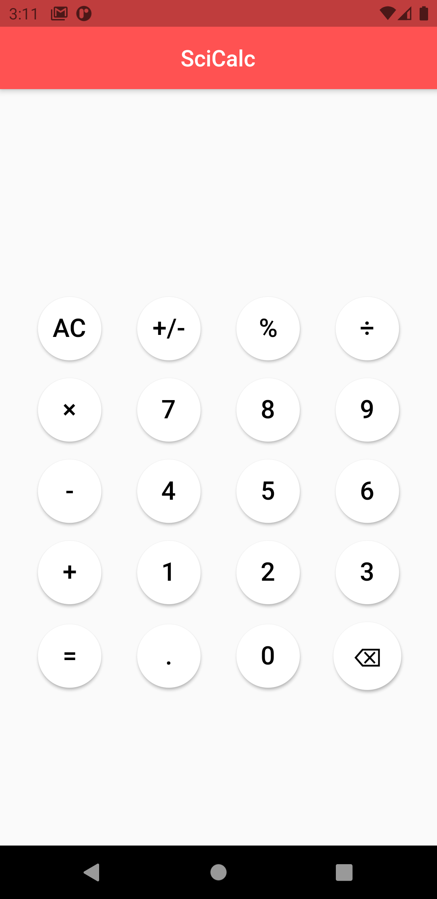
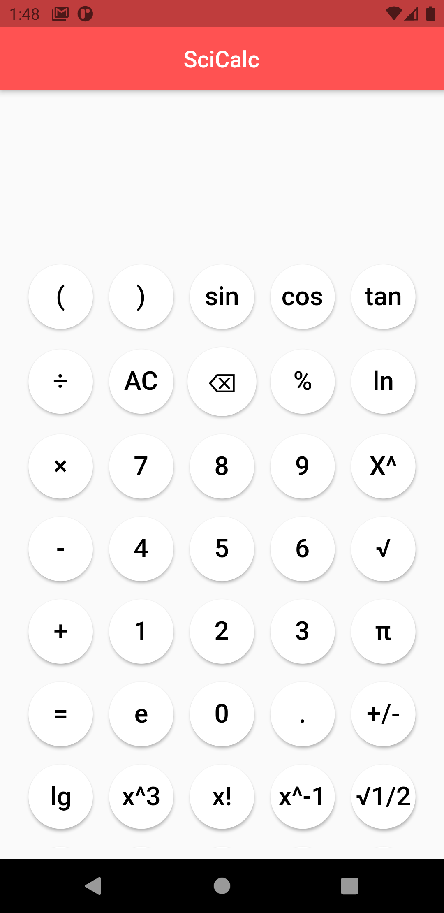
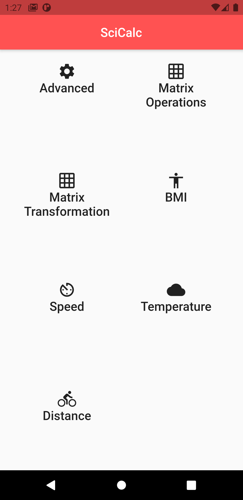
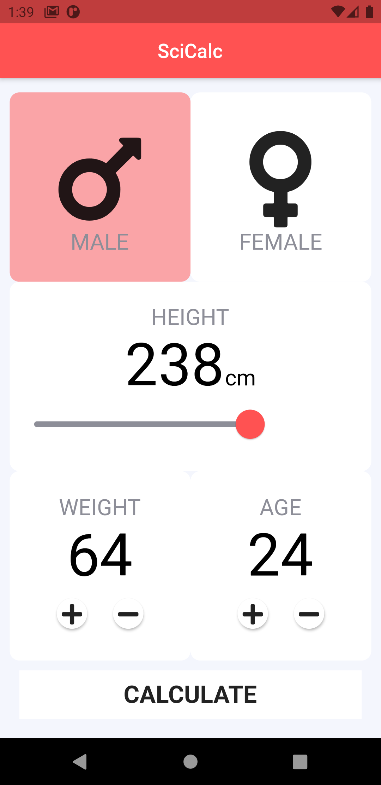
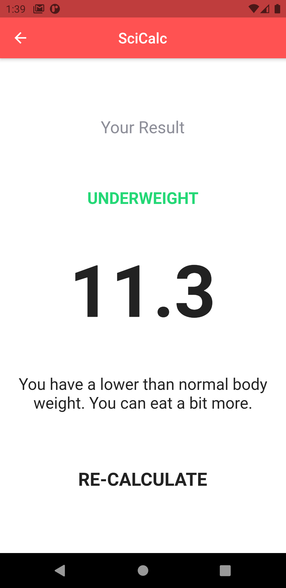
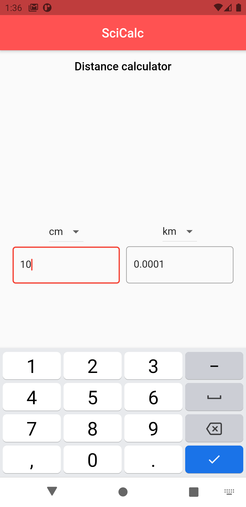
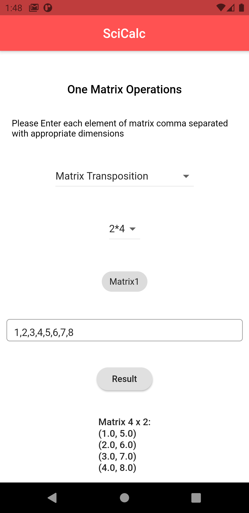
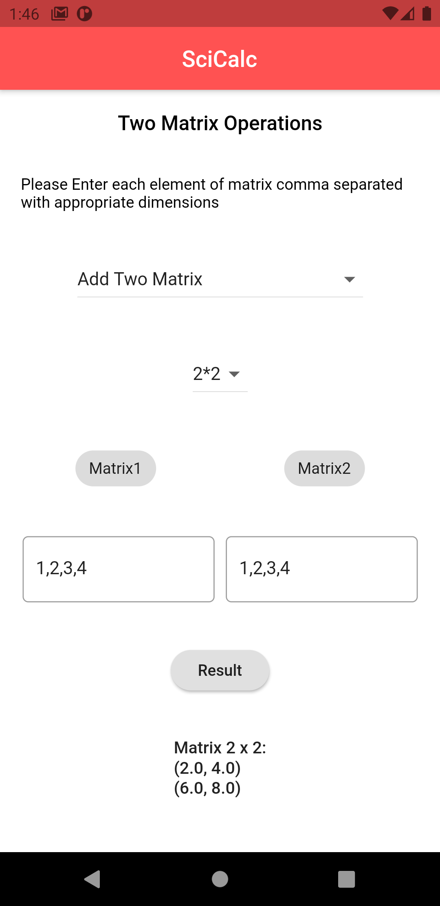

# Scicalc

## Technical description

- flutter_riverpod - state management solution
- few packages like petitparser, expressions and others to parse and evaluate the input expression.

## Features

# Basic Calculation

## 

## We can perform basic calculations such as addition, subtration, multiplication and division of numbers

---

# Advanced Calculation

Supported operations:

- () - Grouping of a huge expression like programming languages which gives result by evaluating based on [BODMAS](https://byjus.com/maths/bodmas-rule/#:~:text=BODMAS%20is%20an%20acronym%20and,is%20the%20synonym%20of%20BODMAS.) rule
- sin - Sine
- cos - Cosine
- tan - Tan
- ln - Natural Logarithm
- log - Logarithm
- X^ - Power of X
- x^3 - Cube of x
- x! - Factorial of x
- x^-1 - X Power of -1
- √½ - sqrt of 1/2
- √ - performs square root operation
- π - inserts value of pi = (22/7) or 3.14
- +, - , \*, /, % - Performs addition, subtraction, multiplication, division, modulo.

---

# Other features

The calc screen is just a pageview which we can slide and choose any other options to to change the view of calc to the selected option.

If basic option is shown, the option will be advanced or if it is advanced, the option will be basic

# BMI Calcuator:

This BMI calculator's design is inspired from Angela Yu's BMI calculator.

### Input screen

### Result screen

# Speed, Distance & Temperature calculation

Speed distance and temperature conversion UI looks almost same, with two dropdowns for from and to conversion and on value changed from one input box, we can get the result on the other and vice versa too.

# Matrix-Operations

## Matrix-Transposition

We need to select the dimension of our matrix from the dropdown and enter the matrix values in the input box as **comma-separated**. For Eg: A 2\*2 matrix values can be 1,2,3,4 or any 4 values and on result is tapped, the result is shown below the result button.

### Supported matrix operations in Matrix-transposition mode:

---

- [x] Matrix Transposition
- [x] Matrix row-wise reduce
- [x] Matrix column-wise reduce
- [x] Sum of matrix elements
- [x] Product of matrix elements
- [x] Max value of Matrix
- [x] Min value of Matrix

---

---

### Supported Matrix operations:

---

- [x] Add Two Matrix
- [x] Add Matrix & Scalar
- [x] Multiply Matrix & vector
- [x] Multiply two Matrix
- [x] Multiply Matrix & Scalar
- [x] Element-wise Matrix Product
- [x] Element-wise Matrix Subtraction

---

